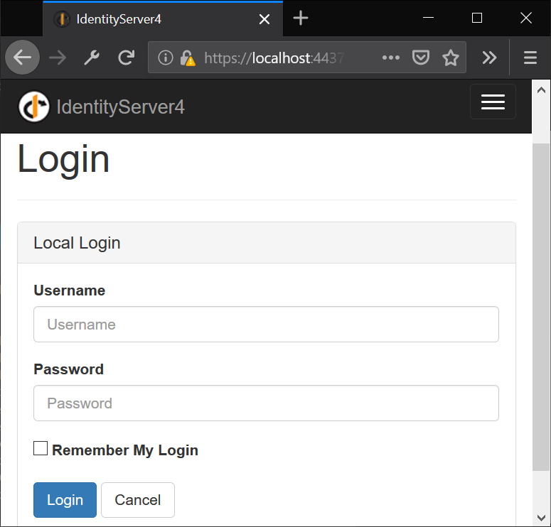
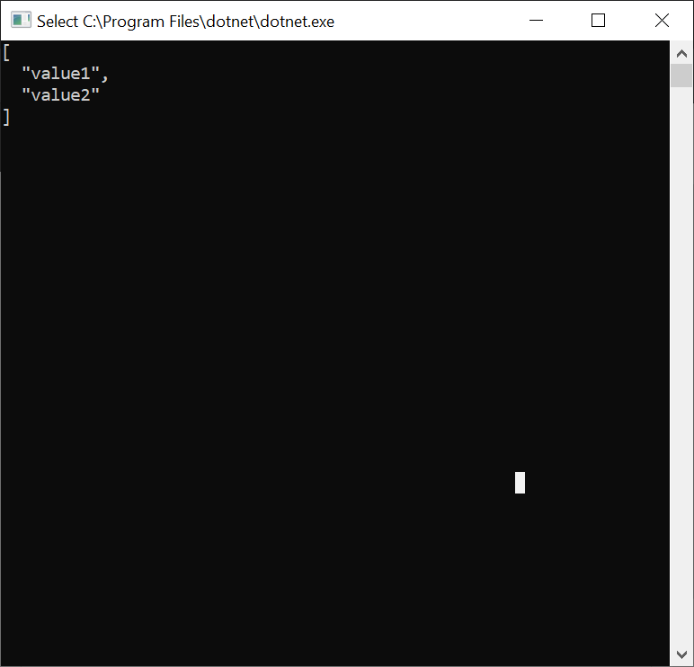

# Identity Server 4

Ejemplo de implementación de [Identity Server 4](http://docs.identityserver.io/) para .Net Core.

## Proyectos

* [**SmartStore.Identity**](src/SmartStore.Identity/). Proyecto encargado de manejar las credenciasles de las aplicaciones. Configurado para migraciones automáticas en la base de datos, la cadena de conexión está en [*appsettings.json*](src/SmartStore.Identity/appsettings.json).

* [**SmartStore.Web**](src/SmartStore.Web/). Proyecto Web de ejemplo con uso de Login.

* [**SmartStore.Api**](src/SmartStore.Api/). Proyecto Api donde se pondrán todo lo relacionado al Backend, configurado con Autenticación JWT *Bearer*.

* [**SmartStore.Console**](src/SmartStore.Console/). Proyecto cliente de ejemplo con llamadas al Api con seguridad agregada.

## Pantallas

